# WatchOrNot

> **One Snap. One Answer. Should you watch it or not?**

Native iOS app for discovering movies you'll love, powered by AI vision recognition and personalized recommendations.

## 📱 Primary Focus: iOS App

This repository is now organized as a **monorepo** with iOS development as the **primary focus**.

```
📱 iOS App (SwiftUI) ⭐ PRIMARY
🔧 Backend API (Node.js) ⭐ SHARED
🌐 Web App (React) 🔒 LEGACY/REFERENCE
```

## Features

- 📸 **Movie Snap** - Point your camera at any movie poster for instant recognition
- 🎯 **Personalized Recommendations** - Get movies tailored to your taste
- 🏆 **Progress Tracking** - Level up from Newcomer to Master Cinephile
- 🎨 **Beautiful Native UI** - SwiftUI design with dark mode
- ⚡ **Fast & Offline-Ready** - Core features work offline

## Repository Structure

```
watchornot-app/
├── packages/
│   ├── ios/              # 📱 iOS App (SwiftUI) - PRIMARY
│   ├── backend/          # 🔧 Backend API (Node.js) - SHARED
│   ├── web/              # 🌐 Web App (React) - LEGACY
│   └── shared/           # 📦 API Contracts & Types
├── docs/                 # 📚 Comprehensive Documentation
├── scripts/              # 🛠️ Build & Automation Scripts
└── .github/workflows/    # ⚙️ CI/CD (iOS + Backend Priority)
```

## Quick Start

### For iOS Development (Recommended)

```bash
# 1. Clone repository
git clone https://github.com/zgkmail/watchornot-app.git
cd watchornot-app

# 2. Install dependencies
npm install

# 3. Setup backend
cd packages/backend
cp .env.example .env
# Edit .env with your API keys (Claude, TMDB, OMDb)
npm install
npm run dev

# 4. Open iOS project
cd ../ios
open WatchOrNot.xcodeproj

# 5. Build & Run in Xcode (⌘R)
```

**Full guide:** [iOS Setup Documentation](./docs/01-getting-started/setup-ios.md)

### For Backend Development

```bash
# Start backend server
cd packages/backend
npm install
npm run dev
# Server runs at http://localhost:3000
```

**Full guide:** [Backend Documentation](./packages/backend/README.md)

### For Web Development (Legacy)

```bash
# Web app is in maintenance mode
cd packages/web
npm install
npm run dev
```

**Note:** Web app is feature-frozen. See [Web README](./packages/web/README.md)

## Development Priorities

### ✅ Active Development (iOS)
- New features implemented in iOS first
- Full CI/CD with automated testing
- Primary documentation focus
- Regular updates and improvements

### ✅ Maintained (Backend)
- Shared by all platforms
- Full test coverage
- API versioning for compatibility
- Regular security updates

### 🔒 Legacy Mode (Web)
- Feature-frozen (no new features)
- Critical bug fixes only
- Kept as reference implementation
- Basic CI to ensure compatibility

## Technology Stack

### iOS App
- **UI:** SwiftUI
- **Language:** Swift 5.9+
- **iOS:** 17.0+
- **Architecture:** MVVM
- **Networking:** URLSession + async/await
- **Persistence:** SwiftData / CoreData
- **Camera:** AVFoundation

### Backend (Shared)
- **Runtime:** Node.js 18+
- **Framework:** Express 4.18
- **Database:** SQLite3
- **AI:** Anthropic Claude (Vision)
- **Movie Data:** TMDB + OMDb APIs

### Web App (Legacy)
- **Framework:** React 18.2
- **Build:** Vite 5.0
- **Styling:** Tailwind CSS 3.4

## Architecture

```mermaid
graph LR
    iOS[📱 iOS App] -->|HTTPS| API[🔧 Backend API]
    Web[🌐 Web App<br/>LEGACY] -.->|HTTPS| API
    API -->|AI Vision| Claude[Claude API]
    API -->|Movie Data| TMDB[TMDB API]
    API -->|Details| OMDb[OMDb API]
    API -->|Store| DB[(SQLite)]

    style iOS fill:#4A90E2
    style API fill:#50C878
    style Web fill:#E8E8E8
```



**Full architecture:** [System Overview](./docs/02-architecture/overview.md)

## Documentation

Comprehensive documentation is available in the [`/docs`](./docs) directory:

### For iOS Developers ⭐
- [📱 iOS Setup Guide](./docs/01-getting-started/setup-ios.md)
- [🏗️ iOS Architecture](./docs/02-architecture/ios-frontend.md)
- [📸 Camera Integration](./docs/05-ios-specific/camera-integration.md)
- [🚀 App Store Submission](./docs/05-ios-specific/app-store-submission.md)

### For Backend Developers
- [🔧 Backend API](./docs/02-architecture/backend-api.md)
- [📖 API Reference](./docs/04-api-reference/endpoints.md)
- [🚀 Deployment Guide](./docs/06-deployment/backend-deployment.md)

### For Web Developers (Maintenance)
- [🌐 Web Setup](./docs/01-getting-started/setup-web.md)
- [🔒 Web Architecture](./docs/02-architecture/web-frontend.md)

## API Endpoints

The backend provides a RESTful API used by all clients:

| Endpoint | Method | Description |
|----------|--------|-------------|
| `/api/claude/analyze` | POST | Analyze movie poster image |
| `/api/onboarding/movies` | GET | Get curated onboarding movies |
| `/api/onboarding/vote` | POST | Submit movie vote |
| `/api/recommendations` | GET | Get personalized recommendations |
| `/api/ratings/history` | GET | Get user's vote history |

**Complete API docs:** [API Reference](./docs/04-api-reference/endpoints.md)

## Development Workflow

### Monorepo Commands

```bash
# Install all dependencies
npm install

# Run backend
npm run dev:backend

# Run web (legacy)
npm run dev:web

# Run all tests
npm run test:all

# Build everything
npm run build:all

# Clean all node_modules
npm run clean
```

### iOS Commands

```bash
cd packages/ios

# Build
xcodebuild -scheme WatchOrNot -destination 'platform=iOS Simulator,name=iPhone 15'

# Test
xcodebuild test -scheme WatchOrNot

# Or use Xcode: ⌘B to build, ⌘R to run, ⌘U to test
```

## CI/CD

Automated workflows for quality assurance:

| Platform | Status | Priority | Runs On |
|----------|--------|----------|---------|
| iOS |  | **HIGH** | Every PR |
| Backend |  | **HIGH** | Every PR |
| Web |  | Low | Weekly |

## Contributing

We welcome contributions! Please see our [Contributing Guide](./docs/07-contributing/) for:

- [Code Style Guide](./docs/07-contributing/code-style.md)
- [Testing Guidelines](./docs/07-contributing/testing-guidelines.md)
- [Pull Request Template](./docs/07-contributing/pull-request-template.md)

### Quick Contribution Steps

1. Fork the repository
2. Create a feature branch (`git checkout -b feature/amazing-feature`)
3. Make your changes
4. Run tests (`npm test`)
5. Commit your changes (`git commit -m 'Add amazing feature'`)
6. Push to branch (`git push origin feature/amazing-feature`)
7. Open a Pull Request

## Roadmap

### Phase 1: MVP (Current) - Weeks 1-8
- [x] Monorepo setup
- [ ] iOS core infrastructure
- [ ] Camera integration
- [ ] Onboarding flow
- [ ] Recommendations
- [ ] User profile

### Phase 2: Polish - Weeks 9-10
- [ ] Dark mode
- [ ] Animations
- [ ] App Store assets
- [ ] TestFlight beta

### Phase 3: Launch - Week 11
- [ ] App Store submission
- [ ] Public release

### Phase 4: Future
- [ ] Watch provider integration
- [ ] Social features
- [ ] Widgets
- [ ] Android app

## Deployment

### Backend
- **Production:** [Fly.io](https://fly.io) / [Railway](https://railway.app)
- **Staging:** Separate instance for testing

See [Backend Deployment Guide](./docs/06-deployment/backend-deployment.md)

### iOS
- **TestFlight:** Beta testing
- **App Store:** Public distribution

See [iOS Deployment Guide](./docs/06-deployment/ios-deployment.md)

### Web (Legacy)
- **Hosting:** [Vercel](https://vercel.com)
- **Status:** Maintenance mode

## Environment Variables

### Backend (.env)
```env
# Required
CLAUDE_API_KEY=sk-ant-...
TMDB_API_KEY=...
OMDB_API_KEY=...

# Optional
PORT=3000
NODE_ENV=development
```

Get API keys from:
- **Claude:** https://console.anthropic.com
- **TMDB:** https://www.themoviedb.org/settings/api
- **OMDb:** http://www.omdbapi.com/apikey.aspx

## License

MIT License - See [LICENSE](./LICENSE) for details.

## Support

- 🐛 **Bug Reports:** [GitHub Issues](https://github.com/zgkmail/watchornot-app/issues)
- 💬 **Questions:** [GitHub Discussions](https://github.com/zgkmail/watchornot-app/discussions)
- 📧 **Security:** See [SECURITY.md](./SECURITY.md)

## Acknowledgments

- **Anthropic Claude** - AI vision recognition
- **TMDB** - Movie database
- **OMDb** - Movie details and ratings
- **Apple** - iOS platform and tools

---

**Built with ❤️ by the WatchOrNot Team**

**Status:** 🚀 Active iOS Development | 🔧 Backend Maintained | 🔒 Web Legacy
