# WatchOrNot System Architecture

High-level overview of the WatchOrNot system architecture.

## System Diagram


## Architecture Principles

### 1. **iOS-First Development**
- Primary development focus on native iOS app
- Web app maintained for reference and testing
- Shared backend ensures consistency

### 2. **Monorepo Structure**
- Single repository for all platforms
- Shared API contracts and types
- Unified CI/CD and versioning

### 3. **Session-Based Authentication**
- Stateful sessions stored server-side
- Session ID in cookie or custom header
- No user accounts (privacy-first)

### 4. **API-Driven Design**
- RESTful API endpoints
- JSON request/response
- Version compatibility maintained

## Technology Stack

### iOS App (Primary)
| Component | Technology | Purpose |
|-----------|-----------|---------|
| **UI Framework** | SwiftUI | Declarative UI |
| **Language** | Swift 5.9+ | Type-safe, modern |
| **Architecture** | MVVM | Clean separation |
| **Networking** | URLSession | Native HTTP client |
| **Persistence** | SwiftData/CoreData | Local storage |
| **Camera** | AVFoundation | Image capture |
| **Testing** | XCTest | Unit/UI tests |
| **CI/CD** | GitHub Actions + Fastlane | Automated builds |

### Backend (Shared)
| Component | Technology | Purpose |
|-----------|-----------|---------|
| **Runtime** | Node.js 18+ | JavaScript server |
| **Framework** | Express 4.18 | Web framework |
| **Database** | SQLite3 | Embedded database |
| **Session Store** | better-sqlite3-session-store | Session persistence |
| **AI** | Anthropic Claude | Vision analysis |
| **Movie Data** | TMDB + OMDb APIs | Movie information |
| **Testing** | Jest | Unit/integration tests |
| **Deployment** | Fly.io / Railway | PaaS hosting |

### Web App (Legacy)
| Component | Technology | Purpose |
|-----------|-----------|---------|
| **UI Framework** | React 18.2 | Component-based UI |
| **Build Tool** | Vite 5.0 | Fast dev server |
| **Styling** | Tailwind CSS 3.4 | Utility-first CSS |
| **Testing** | Vitest | Unit tests |
| **Deployment** | Vercel | Static hosting |
| **Status** | **MAINTENANCE MODE** | Reference only |

### Shared Contracts
| Component | Technology | Purpose |
|-----------|-----------|---------|
| **Types** | TypeScript | API contracts |
| **Codegen** | Custom scripts | Swift model generation |

## Data Flow

### Movie Snap Flow (Camera → Recognition)


### Onboarding Flow (5-Movie Voting)

```mermaid
sequenceDiagram
    participant User
    participant iOS as iOS App
    participant Backend as Backend API
    participant DB as SQLite

    iOS->>Backend: GET /api/onboarding/movies
    Backend-->>iOS: 10 curated movies

    loop Until 5 votes
        User->>iOS: Vote (👍/👎/⏭)
        iOS->>Backend: POST /api/onboarding/vote
        Backend->>DB: Save vote + preferences
        Backend-->>iOS: { votesRemaining }
        iOS->>User: Update progress
    end

    Backend-->>iOS: { onboardingComplete: true }
    iOS->>User: Congratulations screen
```


### Recommendations Flow


## Database Schema

### Sessions Table
```sql
CREATE TABLE sessions (
    session_id TEXT PRIMARY KEY,
    expires INTEGER,
    session_data TEXT
);
```

### Movie Ratings Table
```sql
CREATE TABLE movie_ratings (
    id INTEGER PRIMARY KEY AUTOINCREMENT,
    session_id TEXT,
    movie_id TEXT,
    title TEXT,
    year INTEGER,
    vote TEXT CHECK(vote IN ('up', 'down', 'skip')),
    genres TEXT,    -- JSON array
    directors TEXT, -- JSON array
    cast TEXT,      -- JSON array
    timestamp DATETIME DEFAULT CURRENT_TIMESTAMP
);
```

### Indexes
```sql
CREATE INDEX idx_session_id ON movie_ratings(session_id);
CREATE INDEX idx_vote ON movie_ratings(vote);
CREATE INDEX idx_timestamp ON movie_ratings(timestamp);
```

## API Architecture

### Endpoints Structure
```
/api
├── /claude
│   ├── POST /analyze        # Image recognition
│   └── GET /test            # Health check
├── /onboarding
│   ├── GET /movies          # Get curated movies
│   ├── POST /vote           # Submit vote
│   └── GET /status          # Check completion
├── /recommendations
│   └── GET /                # Get personalized movies
├── /ratings
│   ├── POST /               # Rate a movie
│   ├── GET /history         # Vote history
│   └── DELETE /:id          # Delete history entry
├── /tmdb
│   └── GET /search          # Search movies
└── /omdb
    └── GET /details         # Get movie details
```

### Request/Response Format

**Request Example:**
```http
POST /api/onboarding/vote
Content-Type: application/json
Cookie: connect.sid=abc123

{
  "movieId": "tmdb:123",
  "vote": "up",
  "title": "Inception",
  "year": 2010,
  "genres": ["Sci-Fi", "Thriller"],
  "directors": ["Christopher Nolan"],
  "cast": ["Leonardo DiCaprio"]
}
```

**Response Example:**
```json
{
  "success": true,
  "message": "Vote recorded",
  "totalVotes": 3,
  "onboardingComplete": false
}
```

## Security Architecture

### API Security
- **Rate Limiting:** 100 requests/15min per IP
- **CORS:** Restricted to known origins
- **Input Validation:** All inputs sanitized
- **API Keys:** Server-side only (never exposed)
- **Sessions:** HTTP-only cookies, secure flag in prod

### iOS Security
- **Keychain:** Session ID storage
- **HTTPS Only:** No plaintext communication
- **Certificate Pinning:** (Future enhancement)
- **App Transport Security:** Enforced

## Scalability Considerations

### Current Scale (MVP)
- **Users:** 1-10,000 concurrent
- **Database:** SQLite (single file)
- **Backend:** Single instance
- **Hosting:** PaaS (Fly.io/Railway)

### Future Scale (Production)
- **Database:** PostgreSQL / MySQL
- **Backend:** Load-balanced instances
- **Cache:** Redis for session store
- **CDN:** CloudFlare for static assets
- **Monitoring:** Sentry, DataDog

## Deployment Architecture


## Monitoring & Observability

### Backend Monitoring
- **Logs:** Winston logger (console + file)
- **Metrics:** Request count, latency, errors
- **Alerts:** Error rate > 5%, latency > 2s

### iOS Monitoring
- **Crashes:** (TBD: Firebase Crashlytics)
- **Analytics:** (TBD: Basic usage tracking)
- **Performance:** Xcode Instruments

## Future Enhancements

### Phase 2 Features
- [ ] User accounts (optional)
- [ ] Social features (share recommendations)
- [ ] Watch providers integration (JustWatch API)
- [ ] Offline mode (cached movies)
- [ ] Push notifications (new recommendations)

### Phase 3 Features
- [ ] Android app
- [ ] Watchlist sync across devices
- [ ] AI-powered movie summaries
- [ ] Integration with streaming services

---

## Related Documentation

- [Backend API Details](./backend-api.md)
- [iOS App Architecture](./ios-frontend.md)
- [API Reference](../04-api-reference/endpoints.md)
- [Deployment Guide](../06-deployment/)

---

**Questions?**
See [GitHub Discussions](https://github.com/zgkmail/watchornot-app/discussions)
