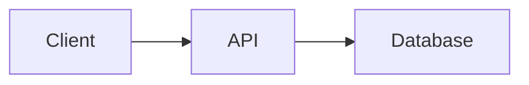

# WatchOrNot Documentation

Comprehensive documentation for the WatchOrNot multi-platform movie recommendation app.

## 📚 Documentation Structure

### [01. Getting Started](./01-getting-started/)
New to WatchOrNot? Start here.
- [Setup Development Environment](./01-getting-started/setup-development.md)
- [Setup iOS Development](./01-getting-started/setup-ios.md) ⭐
- [Setup Web Development](./01-getting-started/setup-web.md)

### [02. Architecture](./02-architecture/)
Understand how WatchOrNot is built.
- [System Overview](./02-architecture/overview.md) ⭐
- [Backend API Architecture](./02-architecture/backend-api.md)
- [iOS App Architecture](./02-architecture/ios-frontend.md) ⭐
- [Web App Architecture](./02-architecture/web-frontend.md)

### [03. Features](./03-features/)
Deep dives into each feature.
- [Movie Snap (Claude Vision)](./03-features/movie-snap.md)
- [Onboarding Flow](./03-features/onboarding.md)
- [Recommendations System](./03-features/recommendations.md)
- [User Profile & Tiers](./03-features/user-profile.md)

### [04. API Reference](./04-api-reference/)
Complete API documentation.
- [API Endpoints](./04-api-reference/endpoints.md) ⭐
- [Data Models](./04-api-reference/data-models.md)
- [Error Handling](./04-api-reference/errors.md)

### [05. iOS-Specific](./05-ios-specific/)
iOS development guides. ⭐ PRIMARY FOCUS
- [Camera Integration](./05-ios-specific/camera-integration.md)
- [Persistence Layer](./05-ios-specific/persistence.md)
- [UI Components Library](./05-ios-specific/ui-components.md)
- [App Store Submission](./05-ios-specific/app-store-submission.md)

### [06. Deployment](./06-deployment/)
Deploy and release WatchOrNot.
- [Backend Deployment (Fly.io/Railway)](./06-deployment/backend-deployment.md)
- [iOS Deployment (TestFlight/App Store)](./06-deployment/ios-deployment.md) ⭐
- [Web Deployment (Vercel)](./06-deployment/web-deployment.md)

### [07. Contributing](./07-contributing/)
Contribute to WatchOrNot.
- [Code Style Guide](./07-contributing/code-style.md)
- [Pull Request Template](./07-contributing/pull-request-template.md)
- [Testing Guidelines](./07-contributing/testing-guidelines.md)

---

## 🎯 Quick Links by Role

### iOS Developer (Primary)
1. [Setup iOS Development](./01-getting-started/setup-ios.md)
2. [iOS Architecture](./02-architecture/ios-frontend.md)
3. [API Endpoints](./04-api-reference/endpoints.md)
4. [Camera Integration](./05-ios-specific/camera-integration.md)

### Backend Developer
1. [Setup Development](./01-getting-started/setup-development.md)
2. [Backend Architecture](./02-architecture/backend-api.md)
3. [API Endpoints](./04-api-reference/endpoints.md)
4. [Backend Deployment](./06-deployment/backend-deployment.md)

### Web Developer (Maintenance)
1. [Setup Web Development](./01-getting-started/setup-web.md)
2. [Web Architecture](./02-architecture/web-frontend.md)
3. [Web Deployment](./06-deployment/web-deployment.md)

---

## 📝 Documentation Standards

### Markdown Format
- Use GitHub-flavored markdown
- Include code examples
- Add diagrams (Mermaid preferred)
- Link to related docs

### Code Examples
```swift
// iOS examples in Swift
struct Example: View {
    var body: some View {
        Text("Example")
    }
}
```

```javascript
// Backend examples in JavaScript
app.get('/api/example', (req, res) => {
  res.json({ message: 'Example' });
});
```

### Diagrams
Use Mermaid for diagrams (renders in GitHub):


---

## 🔄 Keeping Docs Updated

- **API Changes:** Update `04-api-reference/` immediately
- **New Features:** Add to `03-features/`
- **Architecture Changes:** Update `02-architecture/`
- **iOS Updates:** Prioritize `05-ios-specific/`

---

## 🤝 Contributing to Docs

See [Contributing Guidelines](./07-contributing/) for:
- Documentation standards
- How to propose changes
- Review process

---

## ❓ Need Help?

- 🐛 **Bug Reports:** [GitHub Issues](https://github.com/zgkmail/watchornot-app/issues)
- 💬 **Questions:** [Discussions](https://github.com/zgkmail/watchornot-app/discussions)
- 📧 **Contact:** See repository maintainers

---

**Legend:**
- ⭐ = iOS-focused (primary development)
- 🔒 = Web (legacy/maintenance mode)
